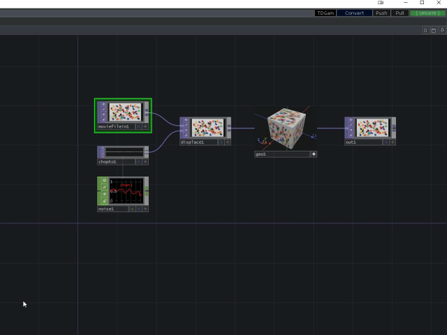
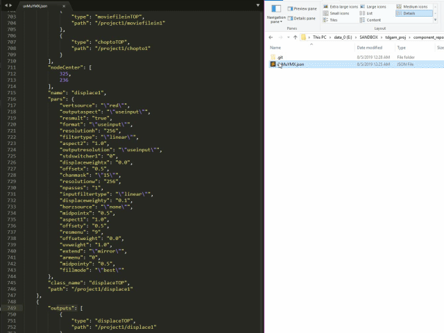
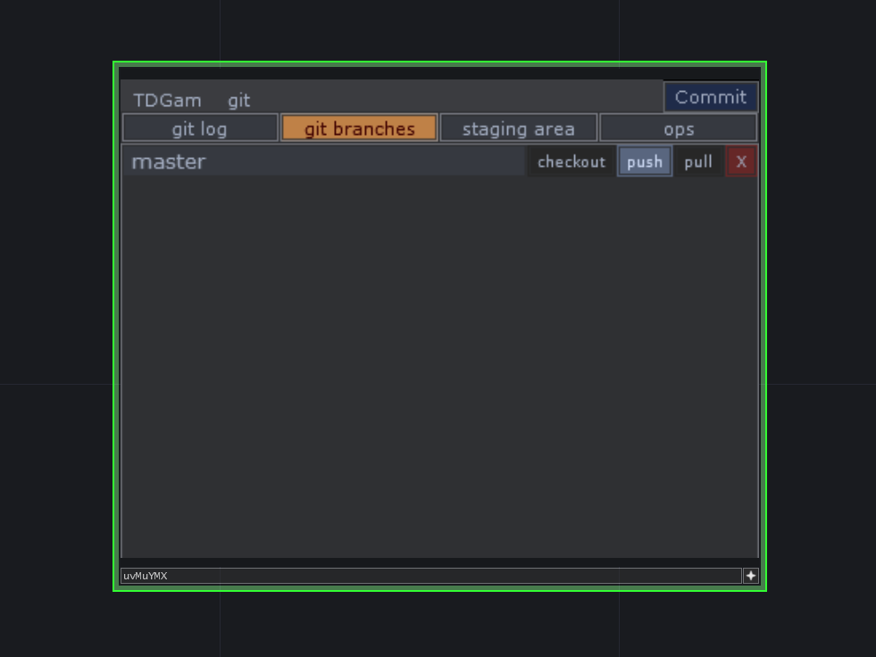
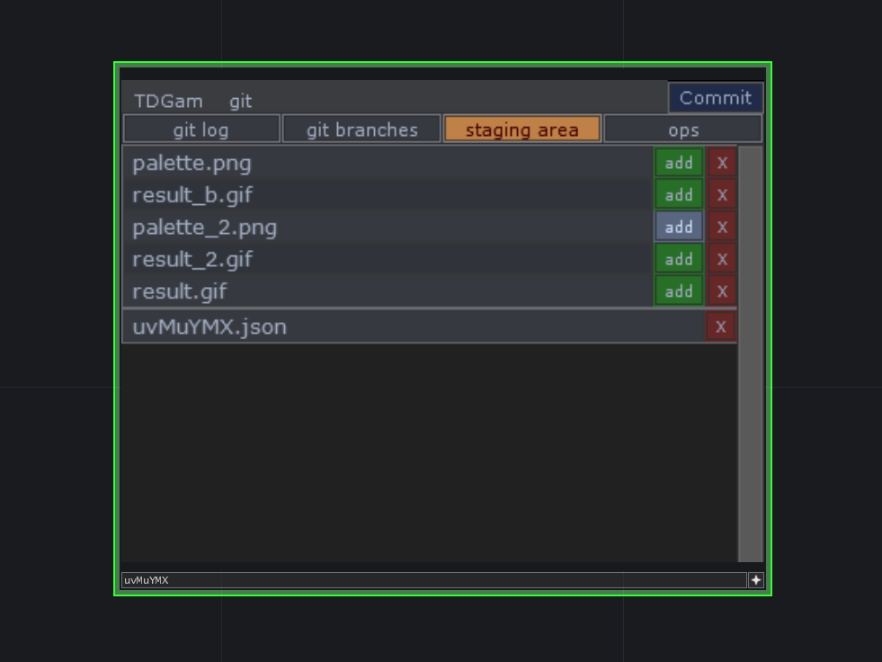
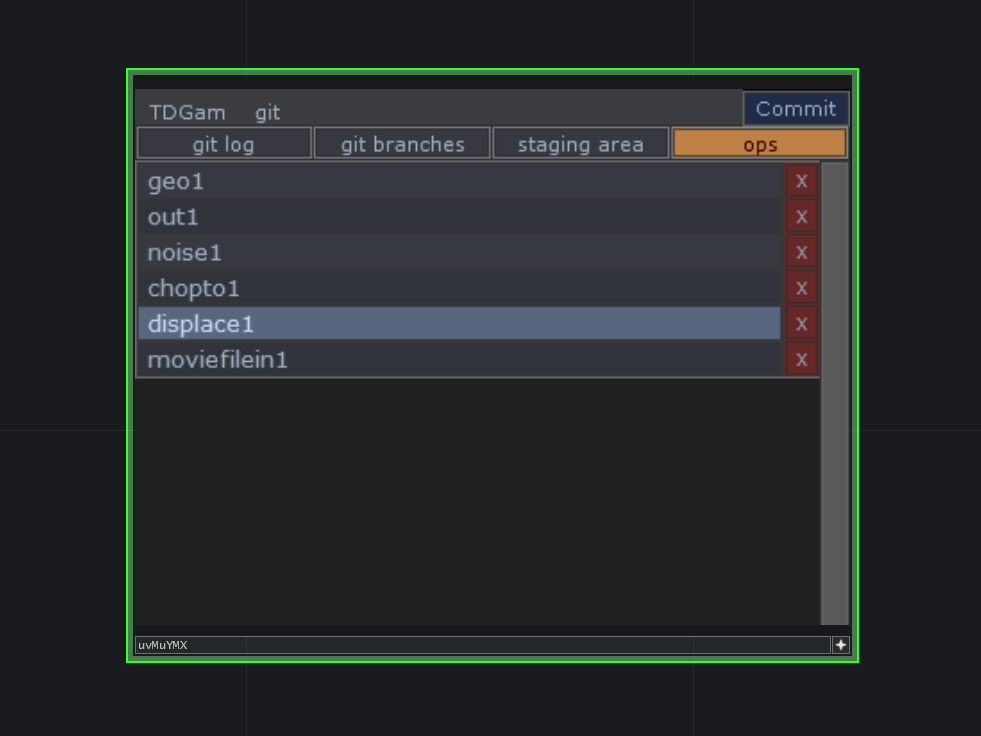
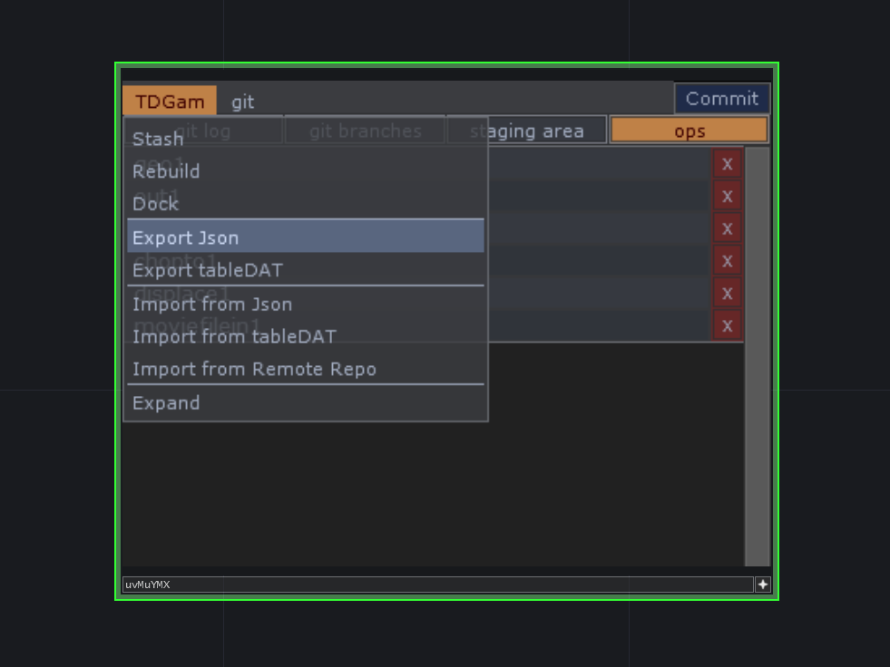
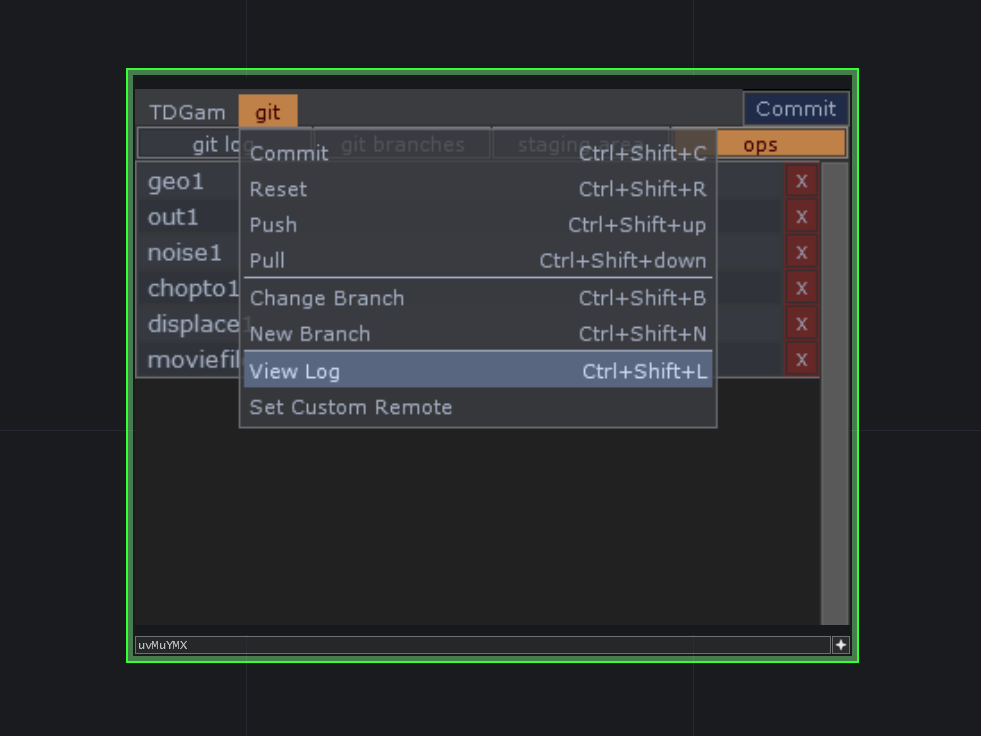
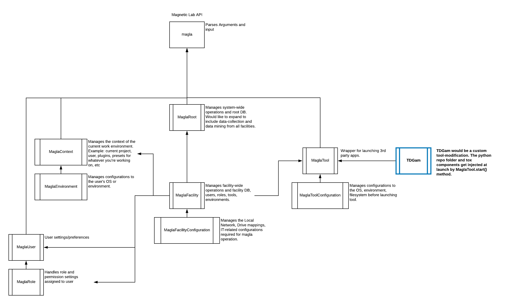

# Touch Designer Git Asset Manager


- Turn a selection of `Touch Designer` ops into a tracked component
- Automatically create local `git` repos for each component
- Push/Pull to github from `Touch Designer`

Built with [Touch Designer](https://www.derivative.ca/), [GitPython](https://github.com/gitpython-developers/GitPython).


`TDGam` is intended to address the need for proper asset management on a large scale in `Touch Designer`. `TDGam` consists of user-created "components" from selections of [ops](https://docs.derivative.ca/OP_Class) in `Touch Designer`.

<p align="center">
  
</p>

Once a component has be created from a selection of ops, a local folder is created containing a `.json` and git repo in the same directory as the `.toe` file. This folder is where all assets used for that component are stored.

<p align="center">
  
</p>

A `TDGam` Project consists of:

- Project (set to a folder with a project git repo)
- Components (saved in subfolders of the Project with component `git` repos)

### Example `TDGam` Project hierarchy:

    Project-directory
        |_(project .git repo)
        |
        |_Components-directory
            |_component-repo-folder
                |_(component .git submodule)
            |_component-repo-folder
                |_(component .git submodule)

### The `TDGam` Component:

#### `Git` Log
View the `git` log history for current branch.


#### `Git` Branches
View the branches for the current component's repo as well as perform checkout/push/pull operations.



#### Staging Area
View the current status of the staging area and manage tracked/untracked files.



#### `Ops`
View a list of the original `ops` making up this component(future `op`-management features to go here).




#### `TDGam`-menu
- **[Stash]** Save all contained `ops'` pars, then destroy all `ops`.
- **[Rebuild]** Rebuild original selection from Component's `.json` data.
- **[Dock]** Dock `ops` to the placeholder.
- **[Export Json]** Export selection-data as `.json`.
- **[Export tableDAT]** Export `tableDAT` containing selection-data.
- **[Import from Json]** Create component from a `.json`.
- **[Import from tableDAT]** Create component from a `tableDAT`.
- **[Import from Remote Repo]** Create component from a remote repo.
- **[Expand]** Rebuild the original selection, then delete the placeholder object.




#### `Git`-menu
- **[Commit]** Commit current staging area.
- **[Reset]** Reset the current staging area.
- **[Push]** Push current staging area to remote repo.
- **[Pull]** Pull changes from remote repo to current branch.
- **[Change Branch]** Checkout target branch.
- **[New Branch]** Create new branch from current staging area.
- **[View Log]** Retrieve the `git` log for current branch.
- **[Set Custom Remote]** Open a confirm dialogue to add a new `git` repo `url` to current component.




#### `MagLa` Path tokening system
Included with this project is a slightly modified version of `MagLa`'s path token system. The goal of using path tokens is for compatibility across platforms, primarily between Linux-Windows. Simultaneous [Windows Linux Subsystem](https://docs.microsoft.com/en-us/windows/wsl/faq) terminal and native CMD prompt will also be supported, so the TD's can have their Linux:).

A token can be described as:
```
<token_name>
```
In this form, `Path` will look for a matching key in ./config/paths.json. Tokens can be made up of other tokens and combined together to create more complex paths. Currently this file must be edited manually in order to develop in your specific environment.

The `Path` module is located at:
```
./lib/maglapath.py
```

#### `TDGam` + `MagLa`
`TDGam` is being developed along side a larger Touch Designer VFX Pipeline management API: `MagLa`.

<p>

</p>
`MagLa` is an effort to consolidate several industry-standard implementations required to run a smooth and effective VFX production pipeline involving Touch Designer.

Main goals of `Magla`:
- Tool and application wrappers/launchers which inject customizations based on current show/project context settings per user.
- Asset-tracking and management using existing open-source libraries like [Gaffer](https://github.com/GafferHQ/gaffer).
- Local per-user development and deployment overrides during production - for testing and deploying code to specific users without altering the rest of the project.
- Ingesting assets and data from external sources like 3rd-party VFX vendors.

## Getting Started

### Prerequisites

* [Install Touch Designer](https://www.derivative.ca/099/Downloads/)

#### Clone this repo, and copy to the `Touch Designer` site-packages folder:
```
<touch designer install folder>\bin\Lib\site-packages\tdgam
```
This should expose the `tdgam` module for importing within Touch Designer. For development it is recommended to instead use a hardlink or symlink to a local development directory.

#### Back up and replace default `mainmenu.tox`
`TDGam` is implemented within Touch Designer as a modification to the main UI. In order to make this modification you must first back up the original `mainmenu.tox` and then copy the one included with this repo. **Please be cautious with this step and don't forget to back up your existing `mainmenu.tox.`**

1. rename the `mainmenu.tox`:
```
<touch designer install folder>\Config\System\mainmenu.tox --> 'mainmenu_backup.tox'
```

2. copy the `mainmenu.tox` included in this repo:
```
<tdgam repo folder>\tox\mainmenu.tox --> <touch designer install folder>\Config\System\mainmenu.tox
```

#### Install Dependencies:
Navigate a terminal or cmd prompt to the `tdgam` repo folder and type:
```
git submodule init
```
Then:
```
git submodule update
```
to pull the third-party dependencies included as submodules:
- [gitdb](https://github.com/gitpython-developers/gitdb)
- [GitPython](https://github.com/gitpython-developers/GitPython)
- [scandir](https://github.com/benhoyt/scandir)
- [smmap](https://github.com/gitpython-developers/smmap)

#### Start a test `MagLa` environment.
`TDGam` is intended to be managed by the `MagLa` pipeline, which would handle injecting the required process customizations each time Touch Designer is launched. To simulate this, a `start.py` script is included which injects the Touch Designer process with required environment variables and appends to the `PYTHONPATH`.

Because this project is still in development the `paths.json` will have to be manually adjusted to your environment.

Navigate to the root `TDGam` repo and run:
```
python start.py
```

## Authors

* **Jacob Martinez** - *Pipeline Technical Director* - [Magnetic-Lab](https://www.magnetic-lab.com/)

## License

This project is licensed under the MIT License - see the [LICENSE.md](LICENSE.md) file for details
